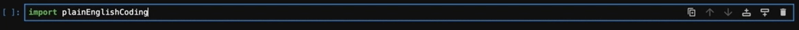

# plainEnglishCoding

Large Language Models (LLMs), including ChatGPT, offer an exciting and powerful way to generate code from plain english prompts.
This project allows Jupyter Notebook or Lab users to generate, run, fix, and explain Python code using plain english prompts and questions in the notebook's cells.
Many other recent Jupyter plugins enable users to ask LLMs coding questions, but the onus is on the user to communicate any relevant context for their question (e.g., relevant information about packages, functions, or objects already in memory).
This package overcomes this hurdle by communicating contextual information about Python objects in memory with each call to OpenAI's API.

This package aims to make interactions with ChatGPT as seemless as possible from Jupyter Notebook, including
- interactive chats directly in the Notebook
- automatic coding from simple plain English prompts (e.g., "Simulate the Lorenz butterfly attractor and plot the resulting trajectory.") 
- automatic knowledge of all variables in active memory
- ability to fix broken code
- ability to explain code

The effective use of this package requires two things from users:
- users must provide their own OpenAI API key (add your key to the chatGPT.py file), and
- users must provide informative documentation (i.e., docstrings) for all functions and classes that they define.

To use the package in an active Jupyter Lab or Notebook, first add the files chatGPT.py and plainEnglishCoding.py to your PYTHONPATH, and then import plainEnglishCoding into your session:

Users can interact with a Chat for Coding object programmatically.
But the preferred way to use this package is through magic commands including `%%chat`, `%%code`, `%%fix`, and `%%explain`.
For example, executing the a coding cell with the magic command `%%chat` in a notebook will produce an interactive chat that ends when the user inputs "done"; here is an example:

Coding prompts use the magic command `%%code` with an optional `-r` flag to automatically execute the generated code.
For example, the following prompt

produces the following output

The generated code imports required libraries that are not already imported, creates a brand new dataframe, and pulls in outside information about US population distributions.
Coding prompts are aware of objects in Python's memory.
In the following example, plainEnglishCoding is asked who is the "tallest" which requires `%%code` to realize the semantic connection to the "Height" column in the dataframe.

More complicated inquires can be asked, for example, asking for statistical analysis of data.

Or, if you prefer using your own custom code, `%%code` command will use the documentation for user-defined functions and classes to create appropriate code.

Here is another example using the Friendship Paradox.
First of all, what is the Friendship Paradox?

Now, let's get some social network data to test for this concept; in this example, I ask `%%code` to download data from the [Stanford SNAP Project](http://snap.stanford.edu/) website.

Let's look at the degree distribution.

and use `%%explain` to get an explanation for the code

If you enjoy this package, then please check out my [website](https://sites.pitt.edu/~mrfrank/)
